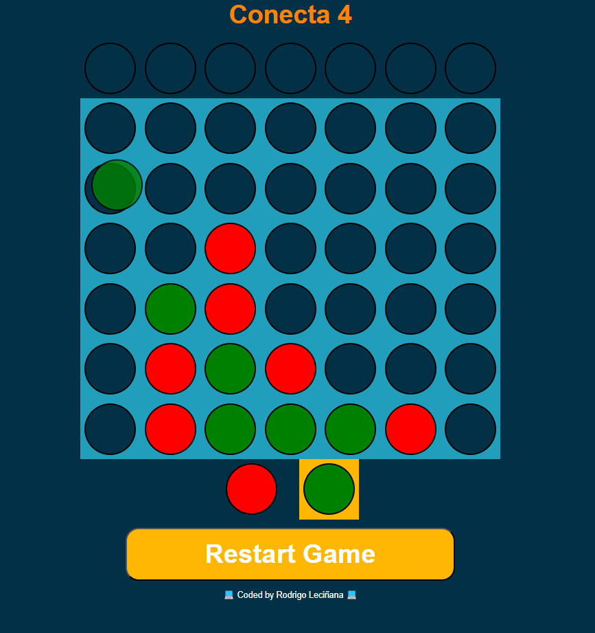

# Conecta 4 by Rodrigo Leciñana   



This project is a web-based implementation of the classic Connect 4 game built using React. The goal of the game is to connect four of your colored discs in a row, either vertically, horizontally, or diagonally, before your opponent does.

## Description

The Connect 4 Game project is part of my portfolio to showcase my skills in React development. It includes the core game functionality, allowing players to drop discs into the grid and detects when a player has won or when the game ends in a draw.

## Features

- Interactive gameplay with a user-friendly interface.
- Implementation of game logic and winning conditions.

## Installation

1. Clone the repository:

```
git clone https://github.com/devrodrigolec/conecta-4.git
```

2. Navigate to the project directory:
``` 
cd connect-4-game
```
3. Install dependencies:

```
npm install
```

## Usage

To start the development server, run:
``` 
npm run dev
```
Open your browser and visit your `http://localhost:your-port` to play the game.

## Technologies Used

- React.
- useState and useEffect hooks.
- Custom hooks.
- HTML5 and CSS3.